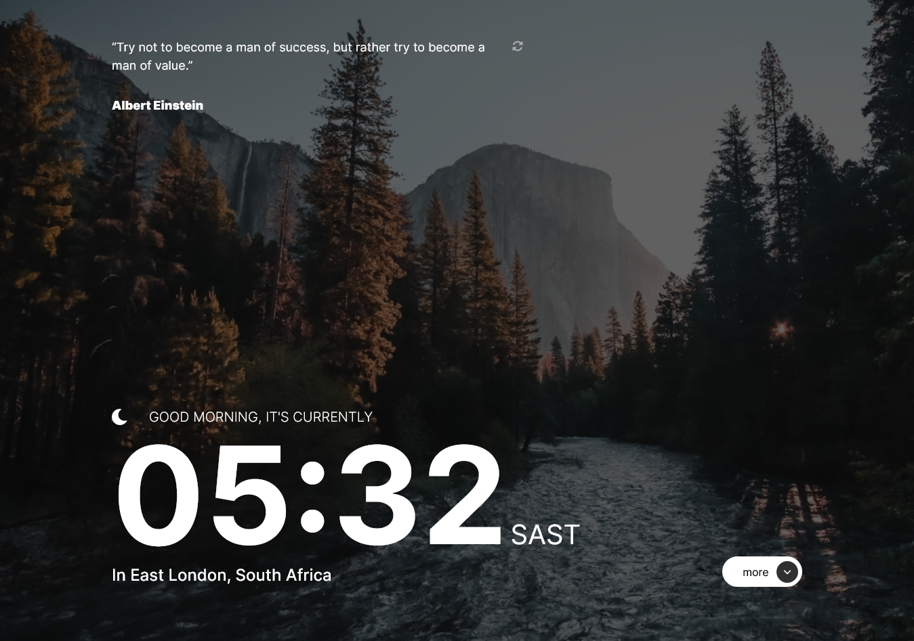

# Frontend Mentor - Clock app solution

This is a solution to the [Clock app challenge on Frontend Mentor](https://www.frontendmentor.io/challenges/clock-app-LMFaxFwrM). Frontend Mentor challenges help you improve your coding skills by building realistic projects.

## Table of contents

- [Overview](#overview)
  - [The challenge](#the-challenge)
  - [Screenshot](#screenshot)
  - [Links](#links)
- [My process](#my-process)
  - [Built with](#built-with)
  - [What I learned](#what-i-learned)
  - [Continued development](#continued-development)
  - [Useful resources](#useful-resources)
- [Author](#author)
- [Acknowledgments](#acknowledgments)

## Overview

### The challenge

Users should be able to:

- View the optimal layout for the site depending on their device's screen size
- See hover states for all interactive elements on the page
- View the current time and location information based on their IP address
- View additional information about the date and time in the expanded state
- Be shown the correct greeting and background image based on the time of day they're visiting the site
- Generate random programming quotes by clicking the refresh icon near the quote

### Screenshot

### Links

- Live Site URL: [Clock App](https://chamumutezva.github.io/clock-app/)

## My process

### Built with

- Semantic HTML5 markup
- sass
- [Parcel](https://parceljs.org/) - JS library for sass compiling
- Flexbox
- CSS Grid
- Mobile-first workflow
- [World Time API](http://worldtimeapi.org/) to set the time based on the visitor's IP adress. This API was     also  used for additional data, like the day of the year shown in the expanded state.
- [IP Geolocation API](https://freegeoip.app/) to set the city and country underneath the time
- [Programming Quotes API](https://api.quotable.io/random) to generate random quortes

### What I learned

- animation using the gsap library. How to use its cdn

### Continued development

- making the site more accessible, using the correct semantic html

### Useful resources

- [GSAP](https://greensock.com/get-started/) animation library

## Author

Website

- [Chamu Mutezva](https://github.com/ChamuMutezva)
- Frontend Mentor - [@ChamuMutezva](https://www.frontendmentor.io/profile/ChamuMutezva)
- Twitter - [@ChamuMutezva](https://twitter.com/ChamuMutezva)

## Acknowledgments

Many thanks to Matt and the Frontend Mentor community at large
